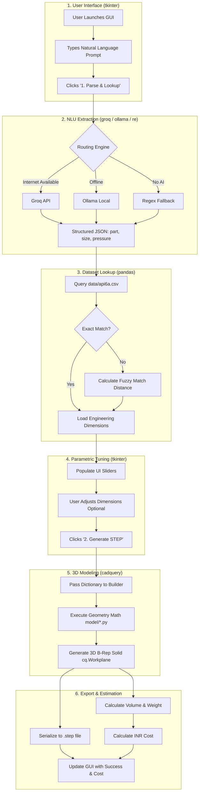

# System Workflow & Data Transfer Lifecycle

This document provides a sequential, step-by-step breakdown of exactly how data moves through the application, from the moment a user launches the graphical interface to the moment a physical 3D file is generated.

---

## 1. Complete Workflow Diagram

The following diagram illustrates the lifecycle of a user prompt and the libraries responsible for each stage.

---

## 2. Step-by-Step Data Transfer Breakdown

Here is a detailed explanation of the data transformations occurring at each stage of the diagram.

### Step 1: User Interaction (The Frontend)
*   **Action:** The user launches the application via `python ui/app.py`. The interface renders on the screen.
*   **Data State:** The user types a raw, unstructured string into the text box (e.g., `"Need a 2-1/16 tee fitting at 15k"`).
*   **Library in use:** `tkinter` (Native Python GUI framework).

### Step 2: Natural Language Extraction (The NLU Parser)
*   **Action:** The user clicks "Parse & Lookup". The raw string is transferred from `ui/app.py` to `extract_request()` in `main.py`.
*   **Data State:** The string is sent as an HTTP request to the cloud LLM. The LLM is forced by a strict system prompt to respond only with data. The raw string is transformed into structured variables:
    *   `part`: `"tee"`
    *   `size_inch`: `2.0625`
    *   `pressure_psi`: `15000`
*   **Libraries in use:** `groq` (Cloud LLM API), `ollama` (Local LLM), `re` (Python Regex).

### Step 3: Matrix Lookup & Fuzzy Matching (The Database)
*   **Action:** The standardized `(part, size, pressure)` variables are passed to `load_dimensions()`.
*   **Data State:** The software reads `data/api6a.csv` into memory as a matrix. It filters the rows to find the exact match. If an engineer asks for an impossible size (e.g., a "3.5 inch tee"), the system calculates a weighted distance score across all rows and returns the mathematically closest alternative.
*   **Output:** The row is converted into a flat Python dictionary containing ~20 specific dimensions (e.g., `{"flange_od": 250, "bore": 52, "bolt_count": 8, ...}`).
*   **Library in use:** `pandas` (Vectorized Data Analysis).

### Step 4: Parametric Override (The Review Phase)
*   **Action:** The dictionary of dimensions is transferred back to the frontend.
*   **Data State:** The GUI dynamically generates interactive sliders for every dimension in the dictionary. The user can review the API 6A standard dimensions and drag a slider to override them (e.g., changing `flange_od` from 250mm to 265mm). The data waits in memory until the user approves it.
*   **Library in use:** `tkinter`.

### Step 5: Topological Generation (The 3D Engine)
*   **Action:** The user clicks "Generate STEP". The finalized dictionary is passed to `build_model()`.
*   **Data State:** The dictionary is routed to a specific geometry builder (e.g., `model/tee.py`). The builder reads the dictionary values and executes sequential mathematical operations. It sketches circles, extrudes them into cylinders, unions the main run and branch pipes, and drills the bolt holes.
*   **Output:** The data becomes a `cq.Workplane` object. This is a true mathematical Boundary Representation (B-Rep) solid living in the computer's RAM.
*   **Library in use:** `cadquery` (Parametric 3D Modeling API).

### Step 6: Export & Material Estimation (The Output)
*   **Action:** The 3D solid is finalized and ready for output.
*   **Data State (Export):** The `cq.Workplane` object is serialized into the ISO 10303 plain-text STEP format and written to your hard drive inside the `output/` directory.
*   **Data State (Estimation):** Simultaneously, the system queries the exact millimeter volume of the solid (`.val().Volume()`). It reads the active material from the GUI dropdown, applies the density formula `(volume * density) = weight_kg`, and applies the cost formula `(weight_kg * rate) = cost_inr`. The GUI text labels are updated with the final ₹ output.
*   **Libraries in use:** `cadquery.exporters` (for STEP serialization) and `tkinter` (for UI updates).
